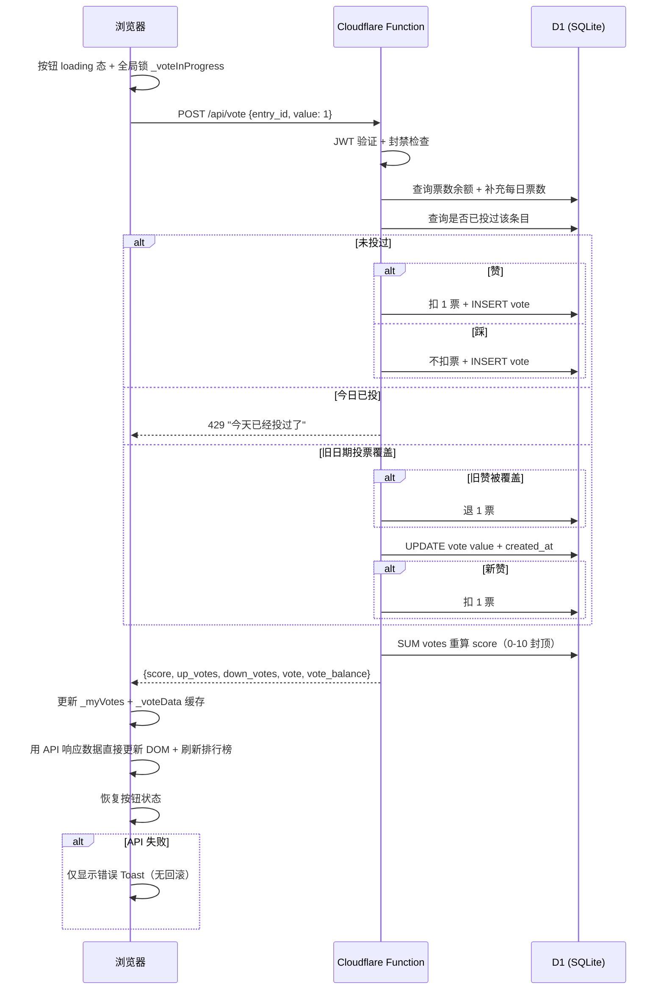
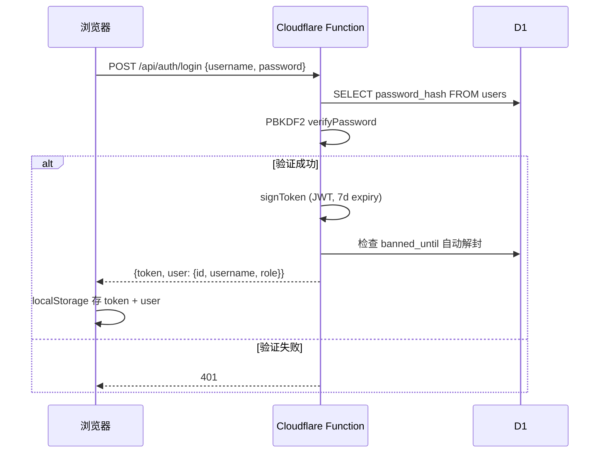
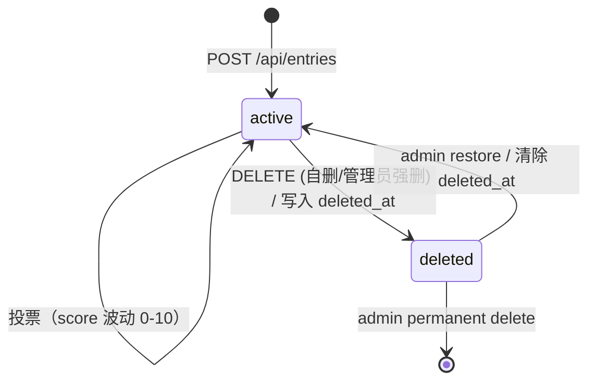
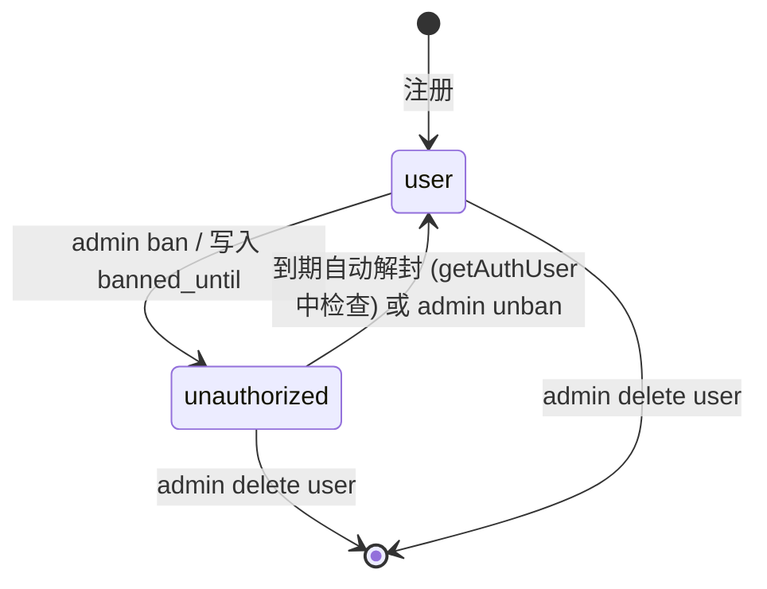

# Architecture

## Pattern Overview

**Overall:** 单体 SPA + Serverless API，部署在 Cloudflare Pages + D1 上喵～

**Key Characteristics:**
- 前端零框架单页应用，四个 tab 切换（排行榜 / 提交 / 账户 / 管理），无客户端路由；登录/注册为独立全屏页面
- 后端 Cloudflare Functions 按文件路径路由，`_middleware.js` 统一 CORS
- 自签 JWT（HMAC-SHA256）存 localStorage，`_utils.js` 提供认证基元
- 软删除模式（`deleted_at` 字段），回收站可恢复

## System Context

**Actors:**
- 浏览器用户（未登录游客 / 已登录用户 / admin / owner）
- 管理员通过 D1 直接操作数据库（角色设定，无注册入口）

**External Systems:**
- Cloudflare Pages — 静态托管 + Functions 运行时
- Cloudflare D1 (SQLite) — 持久化存储
- Google Fonts + jsDelivr CDN — 字体和 marked.js 外链
- GitHub Actions — CI/CD 自动部署（push main → 部署到 Cloudflare Pages）

## Layering

**前端 (SPA)** — 纯静态 HTML/CSS/JS，负责 UI 渲染、Tab 切换、API 驱动更新。`/public/js/` + `/index.html`
- Key abstractions: `App`, `Auth`, `API`, `Components`

**后端 (Cloudflare Functions)** — 无状态 HTTP API，JWT 鉴权，文件路由对应 REST 端点。`/functions/`
- Key abstractions: `_utils.js`（JWT/PBKDF2/json 工具），`_middleware.js`（CORS），`_admin.js`（鉴权中间件）

**数据库 (D1/SQLite)** — 四张表：users / entries / votes / reports，score 由 votes 聚合计算。`/schema.sql`

**Call direction rules:**
- 前端 → 后端单向 HTTP 请求（`/api/*`），JWT Bearer 头传认证
- 后端 → D1 通过 `env.DB` binding，无跨服务调用
- 无事件总线、无消息队列、无微服务间通信

## Scenario Sequences

### 投票流程

### 登录认证流程

## Key Object FSMs

### Entry 生命周期

### User 封禁状态

## Key Design Decisions

- **零框架 SPA** — 原生 HTML/CSS/JS，无 React/Vue，减少依赖和构建步骤。技术选型见 tech-stack.md
- **自签 JWT 认证** — HMAC-SHA256 + PBKDF2 密码哈希，无需第三方 OAuth。安全考量见 conventions.md §Security
- **软删除 + 回收站** — entries 用 `deleted_at` 标记而非物理删除，支持恢复。详见 features.md §回收站
- **10 分制封顶** — score = MAX(0, MIN(10, up_votes - down_votes))，避免极端分差
